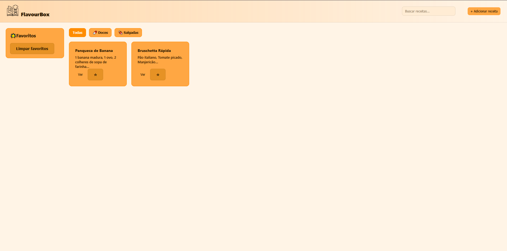
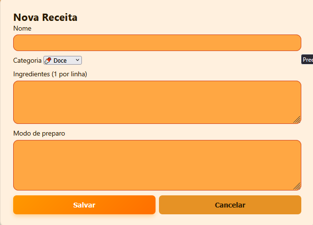
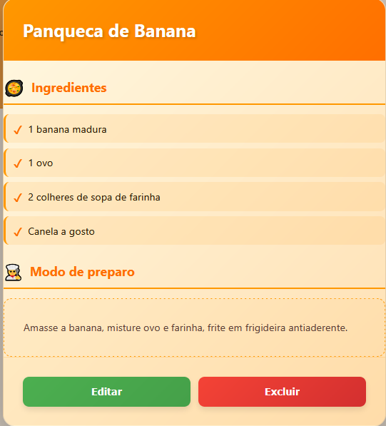
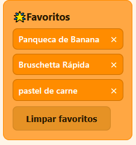

# FlavourBox
site web para guardar e  organizar   suas receitas culinárias como se fosse um diario de receitas,com categorização e sistema de favoritos.
# 📖 FlavourBox - Seu Caderno de Receitas Digital

Aplicação web para guardar, organizar e buscar suas receitas culinárias favoritas com categorização e sistema de favoritos.


## ✨ Funcionalidades

- ➕ **Adicionar Receitas** - Cadastre receitas com nome, categoria, ingredientes e modo de preparo
- 🔍 **Busca Inteligente** - Encontre receitas pelo nome ou ingredientes
- 🏷️ **Categorização** - Organize por Doces 🍬 ou Salgadas 🍖
- ⭐ **Sistema de Favoritos** - Marque e acesse rapidamente suas receitas preferidas
- ✏️ **Editar Receitas** - Atualize receitas existentes a qualquer momento
- 🗑️ **Excluir Receitas** - Remova receitas que não quer mais
- 💾 **Salvamento Automático** - Dados persistem automaticamente no navegador (LocalStorage)
- 🎨 **Interface Intuitiva** - Design clean e fácil de usar
- 📱 **Design Responsivo** - Funciona perfeitamente em desktop, tablet e mobile

## 🛠️ Tecnologias

- **HTML5** - Estrutura semântica
- **CSS3** - Estilização moderna e responsiva
- **JavaScript Vanilla** - Lógica pura sem frameworks
- **LocalStorage API** - Persistência de dados local

## 📂 Estrutura do Projeto
```
flavourbox/
├── index.html          # Página principal
├── style.css           # Estilos
├── app.js              # Lógica da aplicação
└── assar.ico           # Ícone do site
```

## 🚀 Como usar

### Acessar Online

Acesse o site hospedado: [Ver projeto](https://gustavoribeirodeoliveira.github.io/flavourbox)

### Passo a passo:

#### 1️⃣ **Adicionar uma Receita**
   - Clique no botão **"+ Adicionar receita"**
   - Preencha:
     - Nome da receita
     - Categoria (Doce ou Salgada)
     - Ingredientes (um por linha)
     - Modo de preparo
   - Clique em **"Salvar"**

#### 2️⃣ **Buscar Receitas**
   - Use a barra de busca no topo
   - Digite o nome da receita ou ingrediente
   - A busca funciona em tempo real!

#### 3️⃣ **Filtrar por Categoria**
   - Clique em **"Todas"**, **"Doces"** ou **"Salgadas"**
   - Veja apenas as receitas da categoria escolhida

#### 4️⃣ **Favoritar Receitas**
   - Clique na **estrela (☆)** no card da receita
   - A receita aparece na barra lateral de favoritos
   - Clique novamente para desfavoritar

#### 5️⃣ **Ver Detalhes**
   - Clique no botão **"Ver"** em qualquer receita
   - Veja a lista completa de ingredientes e modo de preparo

#### 6️⃣ **Editar ou Excluir**
   - Abra a receita (botão "Ver")
   - Clique em **"Editar"** para modificar
   - Ou clique em **"Excluir"** para remover

### Rodar Localmente

1. Clone o repositório:
```bash
git clone https://github.com/GustavoRibeirodeoliveira/flavourbox.git
```

2. Abra o arquivo `index.html` no navegador

Pronto! Não precisa instalar nada. 🎉

## 💡 Como Funciona (Por Baixo dos Panos)

### Sistema de Armazenamento
```javascript
// As receitas são salvas no LocalStorage
const STORE_KEY = "rb_recipes_v1";

function saveRecipes() {
  localStorage.setItem(STORE_KEY, JSON.stringify(recipes));
}
```

### Estrutura de Dados
```javascript
{
  id: "m5k8x2p9q1",
  name: "Panqueca de Banana",
  category: "doce",
  ingredients: [
    "1 banana madura",
    "1 ovo",
    "2 colheres de sopa de farinha",
    "Canela a gosto"
  ],
  steps: "Amasse a banana, misture ovo e farinha..."
}
```
## 🎨 Interface e Design

### Modal de Visualização de Receita

Ao clicar em "Ver" em qualquer receita, abre-se um modal elegante com:

- **Header gradiente laranja** com o nome da receita em destaque
- **Seção de Ingredientes** 🥘
  - Lista com checkmarks verdes (✓)
  - Cada ingrediente em um card individual
  - Efeito hover interativo
- **Modo de Preparo** 👨‍🍳
  - Texto com borda tracejada estilo "caderno de receitas"
  - Fundo suave para melhor leitura
- **Botões de Ação**
  - **Editar** (verde): Modifica a receita
  - **Excluir** (vermelho): Remove a receita com confirmação
- **Botão X** animado no canto superior direito para fechar

### Características Visuais

- ✨ Animação suave de entrada (slide + fade)
- 🎨 Gradientes modernos em laranja e bege
- 🖱️ Cursores interativos (mãozinha nos clicáveis)
- 📱 Totalmente responsivo
- 🎭 Efeitos hover em todos os elementos interativos
- 🌈 Paleta de cores quente e aconchegante
### Funcionalidades Técnicas

✅ **Geração de IDs únicos** - Cada receita tem um ID único gerado automaticamente
✅ **Filtros em tempo real** - Busca instantânea sem recarregar a página
✅ **Persistência local** - Dados salvos automaticamente no navegador
✅ **Sistema de favoritos independente** - Gerenciado separadamente
✅ **Validação de formulários** - Campos obrigatórios e validações

## 🎨 Recursos Visuais

- Cards modernos com efeito hover
- Modal elegante para adicionar/editar
- Barra lateral de favoritos sempre visível
- Badges de categorias coloridos
- Transições suaves
- Ícones intuitivos
- Design responsivo mobile-first

## 📱 Responsividade

O site se adapta perfeitamente a:
- 💻 **Desktop** - Layout com sidebar e grid
- 📱 **Tablet** - Sidebar recolhível, grid de 2 colunas
- 📱 **Mobile** - Layout vertical, 1 coluna

## ⚠️ Notas Importantes

- ✅ Os dados ficam salvos **apenas no navegador** onde você usou
- ⚠️ Se limpar o cache/dados do navegador, as receitas são apagadas
- 💡 Dica: Para backup, exporte suas receitas (funcionalidade futura)
- 🔒 Privacidade total: seus dados não saem do seu computador

## 📝 Próximas Melhorias

- [ ] Exportar receitas para PDF
- [ ] Importar/exportar dados em JSON
- [ ] Upload de fotos das receitas
- [ ] Avaliação com estrelas (1-5)
- [ ] Tags personalizadas
- [ ] Timer integrado para tempo de preparo
- [ ] Modo de impressão otimizado
- [ ] Compartilhamento por link
- [ ] Conversor de medidas
- [ ] Calculadora de porções

## 📸 Screenshots

### Tela Principal


### Adicionar Receita


### Visualizar Receita


### Favoritos


## 🎯 Destaques do Código

### Busca em Tempo Real
```javascript
search.addEventListener("input", () => 
  renderAll(search.value.trim())
);
```

### Toggle de Favoritos
```javascript
function toggleFav(id) {
  const favs = getFavs();
  const idx = favs.indexOf(id);
  if(idx === -1) favs.push(id); 
  else favs.splice(idx, 1);
  localStorage.setItem("rb_favs", JSON.stringify(favs));
  renderFavs();
}
```

### Filtro por Categoria
```javascript
recipes.forEach(r => {
  if(category !== "all" && r.category !== category) return;
  // renderizar card...
});
```

## 💻 Desenvolvido por

**Gustavo Ribeiro**
- GitHub: [@GustavoRibeirodeoliveira](https://github.com/GustavoRibeirodeoliveira)
- LinkedIn: [Gustavo Ribeiro](https://linkedin.com/in/gustavo-ribeiro-de-oliveira-156632245)

## 📄 Licença

Este projeto está sob a licença MIT. Sinta-se livre para usar, modificar e distribuir.

---

 

💡 Sugestões ou bugs? Abra uma [issue](https://github.com/GustavoRibeirodeoliveira/flavourbox/issues)

🍳 Bom apetite e boas receitas!
